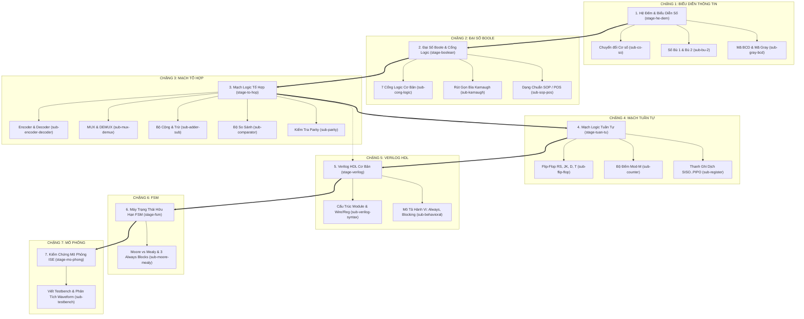

# TÀI LIỆU TOÀN DIỆN VỀ DỰ ÁN THIẾT KẾ LOGIC SỐ & VERILOG HDL
> **Cẩm nang Kiến trúc Hệ thống, Dữ liệu Tri thức & Hướng dẫn Tiếp tục Nghiên cứu Bổ sung**  
> *Dành cho người học và nhà phát triển tiếp tục phát triển nội dung chuyên sâu*

---

## MỤC LỤC TỔNG QUAN

1. [Tổng Quan & Sứ Mệnh Dự Án](#1-tổng-quan--sứ-mệnh-dự-án)
2. [Kiến Trúc Kỹ Thuật & Công Nghệ](#2-kiến-trúc-kỹ-thuật--công-nghệ)
3. [Bản Đồ Cây Thư Mục & Vai Trò Từng Thành Phần](#3-bản-đồ-cây-thư-mục--vai-trò-từng-thành-phần)
4. [Kiến Trúc Dữ Liệu & Cơ Chế Hoạt Động (Data Architecture)](#4-kiến-trúc-dữ-liệu--cơ-chế-hoạt-động-data-architecture)
5. [Giải Mã Hiện Tượng "Dữ Liệu Bị Cắt / Khó Hiểu" & Phân Tích Nguyên Nhân](#5-giải-mã-hiện-tượng-dữ-liệu-bị-cắt--khó-hiểu--phân-tích-nguyên-nhân)
6. [Bản Đồ Tri Thức (Knowledge Map) & 25 Nodes Liên Kết](#6-bản-đồ-tri-thức-knowledge-map--25-nodes-liên-kết)
7. [Chi Tiết 11 Module Giáo Trình Triển Khai](#7-chi-tiết-11-module-giáo-trình-triển-khai)
8. [Hệ Thống Bổ Trợ: 33 Cạm Bẫy, 19 Thuật Ngữ, 36 Flashcards & 31 Quizzes](#8-hệ-thống-bổ-trợ-33-cạm-bẫy-19-thuật-ngữ-36-flashcards--31-quizzes)
9. [Cẩm Nang Hướng Dẫn Tự Bổ Sung & Mở Rộng Kiến Thức](#9-cẩm-nang-hướng-dẫn-tự-bổ-sung--mở-rộng-kiến-thức)
10. [Hướng Dẫn Vận Hành, Phím Tắt & Triển Khai](#10-hướng-dẫn-vận-hành-phím-tắt--triển-khai)

---

# 1. TỔNG QUAN & SỨ MỆNH DỰ ÁN

### 1.1. Bối cảnh ra đời
Dự án **study-logic-app** được thiết kế như một **Learning Operating System (Hệ điều hành học tập cá nhân)** dành riêng cho môn học:
- **Điện tử số (Chương 1 đến 4)**
- **Thiết kế Logic số với Verilog HDL (Lecture 1 đến 6)**
- **Mô phỏng & Kiểm chứng phần cứng trên ISE Xilinx 14.7**

### 1.2. Nguồn tài liệu gốc hình thành dự án
Toàn bộ nội dung và kiến thức trong hệ thống bắt nguồn từ 11 tài liệu kỹ thuật chuẩn:
1. `C1- He diem.pdf`: Hệ đếm, chuyển đổi cơ số, mã BCD, Excess-3, Gray, số có dấu bù 1 và bù 2.
2. `C2-Ham Boole va cong Logic.pdf`: Đại số Boole, định luật DeMorgan, minterm, maxterm, 7 cổng logic cơ bản.
3. `C3-Mach Logic to hop.pdf`: Thiết kế mạch tổ hợp, Encoder, Decoder, LED 7 đoạn, MUX, DEMUX, Adder, Subtractor, Comparator, Parity.
4. `C4-Mach Logic tuan tu.pdf`: Flip-Flop RS, JK, D, T, bảng kích thích, bộ đếm (Counter Mod-M) và thanh ghi dịch (Shift Register).
5. `Lecture_1-Tong quan ve Thiet ke so voi HDL.pdf`: Luồng thiết kế số Top-down/Bottom-up, chu trình RTL đến nạp chip.
6. `Lecture_2-Tổng quan về Verilog HDL.pdf`: Cấu trúc module, port list, phân biệt phần cứng giữa `wire` và `reg`, định dạng số học.
7. `Lecture_3-Toan tu trong Verilog.pdf`: Toán tử số học, logic, bitwise, reduction, ghép vector `{A, B}`.
8. `Lecture_4-Cau truc module.pdf`: Phân cấp module, positional port mapping và named port mapping.
9. `Lecture_5-Mô tả hành vi.pdf`: Khối `always`, `initial`, blocking (`=`) vs non-blocking (`<=`), lệnh `if-else`, `case` và lỗi inadvertent latch.
10. `Lecture_6-May trang thai FSM.pdf`: Máy trạng thái hữu hạn Moore vs Mealy, khung code 3 khối `always` chuẩn công nghiệp.
11. `Huong dan mo phong mach dung ISE Xilinx 14.7.docx`: Quy trình 10 bước tạo project, viết testbench, sinh xung nhịp, chạy ISim và đọc waveform.

### 1.3. Triết lý thiết kế (Cognitive Pedagogical Architecture)
Ứng dụng từ chối cách tiếp cận đọc văn bản thụ động (như file PDF hay blog thông thường). Thay vào đó, hệ thống được thiết kế theo vòng lặp nhận thức chủ động:
```text
  [1. Định hướng 60 giây] 
            ↓
  [2. Đọc kiến thức cốt lõi & Callout Cạm bẫy/Mẹo] 
            ↓
  [3. Tương tác Thẻ nhớ 3D (Active Recall)] 
            ↓
  [4. Đánh giá thực chiến với Quiz 4 định dạng] 
            ↓
  [5. Định vị trên Bản đồ Tri thức (Knowledge Mindmap)]
```

---

# 2. KIẾN TRÚC KỸ THUẬT & CÔNG NGHỆ

Hệ thống được xây dựng trên nền tảng web hiện đại, tĩnh hóa tối đa (SSG) để đảm bảo tốc độ mở trang tức thì và hoạt động hoàn toàn độc lập mà không cần máy chủ backend phức tạp:

| Thành phần | Công nghệ sử dụng | Vai trò kiến trúc |
|---|---|---|
| **Core Framework** | Next.js 14.2.13 (App Router) | Định tuyến trang tĩnh (SSG), sinh mã HTML tại build time |
| **Ngôn ngữ** | TypeScript 5.6.2, React 18.3.1 | Đảm bảo tính an toàn dữ liệu, chống lỗi runtime type |
| **Styling & Theme** | Tailwind CSS 3.4.10, CSS Variables | Token hóa màu sắc giao diện (HSL), hỗ trợ Dark/Light Theme hoàn hảo |
| **Typography** | `Plus Jakarta Sans` & `JetBrains Mono` | Tối ưu độ dễ đọc tiếng Việt và căn lề bảng chân trị / mã Verilog |
| **Iconography** | Lucide React (v0.428.0) | Hệ thống icon tối giản, trực quan và hiện đại |
| **Markdown Engine** | `react-markdown` 9 + `remark-gfm` 4 | Phân tích cú pháp markdown, sinh liên kết thẻ tự động, render bảng |
| **Code Highlighting** | Custom CodeBlock + PrismJS tokens | Tô màu cú pháp Verilog HDL, sao chép code 1-click |
| **Lưu trữ Trạng thái** | LocalStorage API | Lưu giữ tiến độ bài đọc, lịch sử làm quiz, trạng thái flashcard, bookmark |
| **Triển khai (Deploy)**| Netlify (`netlify.toml`) / Vercel | Hỗ trợ CI/CD tự động khi push code lên GitHub |

---

# 3. BẢN ĐỒ CÂY THƯ MỤC & VAI TRÒ TỪNG THÀNH PHẦN

Cấu trúc dự án được phân cấp chuyên biệt theo mô hình Component-Driven và Data-Separated:

```text
TK Logic Số/
├── app/                           # CÁC TUYẾN TRANG (NEXT.JS APP ROUTER)
│   ├── layout.tsx                 # Root layout: ThemeProvider, AppShell, Header, Sidebar
│   ├── page.tsx                   # Trang chủ Dashboard: Thống kê tổng quan, Quick start
│   ├── globals.css                # Biến màu CSS Variables (Tokens) và cấu hình font chữ
│   ├── loading.tsx / error.tsx    # Giao diện skeleton loading và màn hình bắt lỗi runtime
│   ├── not-found.tsx              # Trang 404 tùy biến
│   │
│   ├── learn/                     # Tuyến Giáo trình & Bài học
│   │   ├── page.tsx               # Danh mục 11 module theo 4 nhóm kiến thức
│   │   └── [slug]/page.tsx        # Trang chi tiết bài đọc: Header, TOC, Markdown, Action Hub
│   │
│   ├── map/page.tsx               # Tuyến Bản đồ Tri thức tương tác (Knowledge Mindmap)
│   ├── traps/page.tsx             # Tuyến 33 Cạm bẫy thiết kế phần cứng kinh điển
│   ├── glossary/page.tsx          # Tuyến Từ điển thuật ngữ & công thức toán học
│   ├── review/page.tsx            # Tuyến Ôn tập Thẻ nhớ 3D (Active Recall Flashcards)
│   ├── quiz/page.tsx              # Tuyến Kiểm tra trắc nghiệm (Luyện tập & Thi thử)
│   └── settings/page.tsx          # Tuyến Quản lý tiến độ, Export/Import JSON dữ liệu
│
├── components/                    # CÁC THÀNH PHẦN GIAO DIỆN (REUSABLE UI)
│   ├── layout/                    # Thành phần khung ứng dụng
│   │   ├── AppShell.tsx           # Bố cục bao bọc chính
│   │   ├── Header.tsx             # Thanh điều hướng trên, nút search, toggle theme
│   │   ├── Sidebar.tsx            # Menu điều hướng cột trái desktop
│   │   ├── MobileNav.tsx          # Thanh menu điều hướng đáy màn hình mobile
│   │   ├── SearchModal.tsx        # Command Palette (Ctrl + K) tìm kiếm toàn diện
│   │   └── ThemeToggle.tsx        # Chuyển đổi giao diện Sáng / Tối
│   │
│   ├── learning/                  # Thành phần hỗ trợ đọc & học sâu
│   │   ├── CourseNav.tsx          # Cột trái danh sách bài học khi đọc
│   │   ├── TableOfContents.tsx    # Cột phải mục lục tiêu đề (TOC) cuộn mượt
│   │   ├── ReadingProgressBar.tsx # Thanh tiến trình đọc bám sát theo độ dài trang
│   │   ├── LessonExecutiveSummary.tsx # Khung tóm tắt 60 giây & Mục tiêu bài học
│   │   ├── LessonActionHub.tsx    # Khung kích hoạt chuyển sang Quiz / Flashcard
│   │   ├── LessonFooter.tsx       # Điều hướng Bài học trước / Bài học sau
│   │   ├── KnowledgeMap.tsx       # Bảng đồ họa 25 nodes tri thức
│   │   └── NodeInspector.tsx      # Cửa sổ xem chi tiết thông tin node được chọn
│   │
│   ├── markdown/                  # Bộ xử lý hiển thị văn bản Markdown
│   │   ├── CodeBlock.tsx          # Khối hiển thị code Verilog có nút sao chép
│   │   ├── FormulaCard.tsx        # Khối công thức toán học nổi bật
│   │   └── TrapCard.tsx           # Khối hiển thị đối chiếu Sai / Đúng của cạm bẫy
│   │
│   ├── review/                    # Thành phần ôn tập
│   │   └── Flashcard.tsx          # Thẻ lật 3D tương tác với CSS 3D Transforms
│   │
│   └── quiz/                      # Thành phần bài kiểm tra
│       └── QuizCard.tsx           # Hiển thị 4 loại câu hỏi, chấm điểm và giải thích
│
├── data/                          # CƠ SỞ DỮ LIỆU TĨNH (STRUCTURED STATIC DATA)
│   ├── curriculum.ts              # 11 Module giáo trình, danh mục, thứ tự, điều kiện tiên quyết
│   ├── knowledge-map.ts           # 25 Nodes tri thức, 7 khối xương sống, quan hệ cha-con
│   ├── traps.ts                   # 33 Cạm bẫy thiết kế: mô tả sai, sửa đúng, mẹo nhớ
│   ├── glossary.ts                # 19 Thuật ngữ chuyên sâu: định nghĩa, công thức, liên kết
│   ├── flashcards.ts              # 36 Thẻ nhớ 3D: Mặt trước (câu hỏi/bẫy), Mặt sau (đáp án/mẹo)
│   └── quizzes.ts                 # 31 Câu hỏi: MCQ, Đúng/Sai, Điền từ, Đọc hiểu mã Verilog
│
├── lib/                           # THƯ VIỆN XỬ LÝ DỮ LIỆU LOGIC
│   ├── types.ts                   # Khai báo cấu trúc TypeScript Types & Interfaces
│   ├── content.ts                 # Chứa chuỗi rawLessonsContent (Nội dung 11 bài) & hàm trích xuất
│   ├── markdown.tsx               # Cấu hình ReactMarkdown & quy tắc nhận diện Callouts
│   ├── progress.ts                # Các hàm thao tác với LocalStorage (lưu/đọc tiến độ)
│   └── utils.ts                   # Hàm tiện ích cn (clsx + tailwind-merge)
│
├── content/                       # NỘI DUNG TỔNG HỢP GỐC
│   └── tong-hop-thiet-ke-logic-so-verilog.md # File markdown 912 dòng đúc kết ban đầu
│
├── docs/                          # TÀI LIỆU ĐẶC TẢ THIẾT KẾ
│   └── ANTIGRAVITY_BUILD_GUIDE_LEARNING_UI.md # Bộ chỉ dẫn thiết kế chi tiết 6 Phase
│
├── netlify.toml                   # Cấu hình triển khai tự động lên Netlify
├── package.json                   # Danh mục dependencies và scripts điều khiển
└── tailwind.config.ts             # Cấu hình bảng màu giao diện semantic
```

---

# 4. KIẾN TRÚC DỮ LIỆU & CƠ CHẾ HOẠT ĐỘNG (DATA ARCHITECTURE)

Dữ liệu của toàn bộ dự án hoạt động theo mô hình phi tập trung nhưng liên kết chặt chẽ thông qua các khóa định danh chung: `slug`, `lessonSlug`, và `nodeId`.

### 4.1. Bản thiết kế cấu trúc dữ liệu (`lib/types.ts`)
```typescript
// 1. Cấu trúc một bài học đầy đủ
export type Lesson = {
  slug: string;                 // Mã định danh duy nhất (VD: "he-dem", "fsm")
  order: number;                // Thứ tự học (1 -> 11)
  title: string;                // Tiêu đề bài học
  description: string;          // Mô tả ngắn
  estimatedMinutes: number;     // Thời lượng ước tính đọc (phút)
  prerequisiteSlugs: string[];  // Danh sách các bài cần học trước
  headings: HeadingNode[];      // Danh sách tiêu đề mục H2, H3 phục vụ TOC
  tags: string[];               // Nhãn phân loại nhóm kiến thức
  content: string;              // Nội dung định dạng Markdown
  objectives?: string[];        // 3 mục tiêu nhận thức cốt lõi
};

// 2. Cấu trúc Cạm bẫy thiết kế (Trap)
export type TrapItem = {
  id: string;                   // Mã bẫy (VD: "trap-1")
  category: string;             // Phân loại môn học
  title: string;                // Tên tình huống gây bẫy
  wrong: string;                // Cách hiểu sai phổ biến của sinh viên
  correct: string;              // Cách làm / tư duy chuẩn phần cứng
  memoryTip?: string;           // Câu thần chú / mẹo nhớ nhanh
  lessonSlug: string;           // Liên kết trực tiếp về bài học nào
  priority: 'high' | 'normal';  // Độ ưu tiên cảnh báo
};

// 3. Cấu trúc Câu hỏi trắc nghiệm (Quiz)
export type QuizQuestion = {
  id: string;
  lessonSlug: string;
  type: 'mcq' | 'true-false' | 'fill' | 'code-reading';
  prompt: string;               // Đề bài câu hỏi
  options?: string[];           // Các lựa chọn (với câu trắc nghiệm)
  correctAnswer: string | boolean;
  explanation: string;          // Lời giải thích cặn kẽ tại sao đúng/sai
  relatedSection?: string;
  difficulty: 'basic' | 'medium' | 'hard';
};

// 4. Cấu trúc Thẻ nhớ lật 3D (Flashcard)
export type FlashcardItem = {
  id: string;
  category: 'formula' | 'concept' | 'trap' | 'verilog';
  front: string;                // Mặt trước: câu hỏi, công thức cần nhớ
  back: string;                 // Mặt sau: lời giải thích, bảng chân trị
  lessonSlug: string;
  tip?: string;                 // Mẹo ghi nhớ thực chiến
};
```

### 4.2. Quản lý trạng thái học tập (LocalStorage Schema)
Hệ thống không dùng cơ sở dữ liệu server để người dùng hoàn toàn sở hữu dữ liệu của mình. Khi học tập, trình duyệt sẽ lưu vào khóa `logic_study_progress`:
```json
{
  "completedLessons": ["he-dem", "dai-so-boole"],
  "completedSections": ["chuyen-doi-co-so", "dinh-luat-demorgan"],
  "bookmarks": ["trap-31", "g-fsm"],
  "quizHistory": [
    { "quizId": "quiz-module-01", "score": 4, "total": 4, "completedAt": "2026-09-23T..." }
  ],
  "flashcardState": {
    "fc-he-dem-01": "known",
    "fc-boole-01": "learning"
  },
  "lastVisitedLesson": "karnaugh"
}
```

---

# 5. GIẢI MÃ HIỆN TƯỢNG "DỮ LIỆU BỊ CẮT / KHÓ HIỂU" & PHÂN TÍCH NGUYÊN NHÂN

Một trong những thắc mắc lớn nhất khi bạn trực tiếp sử dụng web app là: **"Tại sao đọc bài trên trang web thấy nội dung bị ngắn, có chỗ bị cắt gọt khiến một số khái niệm trở nên khó hiểu?"**

Dưới đây là phân tích kỹ thuật và nguyên nhân cốt lõi:

### 5.1. Hai nguồn nội dung song song trong dự án
Trong mã nguồn hiện tại đang tồn tại 2 nơi lưu trữ văn bản:
1. **Nguồn 1: `content/tong-hop-thiet-ke-logic-so-verilog.md`** (912 dòng). Đây là bản tóm lược toàn diện ban đầu, có đầy đủ mục lục, lộ trình 18-20 giờ, checklist ôn tập, bảng đối chiếu 40 bẫy.
2. **Nguồn 2: `lib/content.ts` (biến `rawLessonsContent`)**. Khi agent chuyển đổi dự án sang giao diện web đọc theo từng module, agent đã trích xuất và phân chia văn bản thành 11 đoạn ngắn để đưa vào code `rawLessonsContent`.

### 5.2. Nguyên nhân dẫn đến việc dữ liệu bị cắt gọt:
- **Tối ưu hóa cho thời gian đọc ngắn (Micro-learning):** Mỗi bài đọc trên web được thiết lập thời lượng ước tính từ 75 đến 120 phút. Để giao diện gọn gàng, các bài giảng đã bị cắt ngắn thành các "gạch đầu dòng tóm tắt" thay vì diễn giải chi tiết từng bước.
- **Lược bỏ các ví dụ tính toán từng bước:** Trong các phần như *Chuyển đổi cơ số lẻ*, *Quy tắc bù 2 cho số âm lớn*, *Ví dụ rút gọn bìa Karnaugh 4 biến có don't-care (X)*, hay *Quy trình lập bảng kích thích bộ đếm Mod-6*, nội dung hiện tại chỉ ghi kết quả và công thức chung, thiếu các bước trung gian dẫn đến việc người đọc mới khó tiếp thu.
- **Sự phân mảnh dữ liệu giữa các Tab chức năng:**
  - Phần lý thuyết nằm ở `/learn/[slug]`.
  - Nhưng ví dụ về lỗi sai và cách sửa lại bị tách sang trang `/traps`.
  - Công thức và định nghĩa sâu lại bị tách sang trang `/glossary`.
  - Các bài tập trắc nghiệm và câu hỏi code Verilog lại nằm ở `/quiz`.
  *Hậu quả là nếu bạn chỉ đọc một trang bài giảng duy nhất trên `/learn`, bạn sẽ cảm giác thiếu hẳn phần bài tập áp dụng và các cạm bẫy thực tế.*
- **Giới hạn chuỗi Template Literal trong TypeScript:** Việc nhúng văn bản Markdown dài hàng ngàn dòng trực tiếp bên trong file TypeScript (`lib/content.ts`) khiến việc trình bày các khối code mẫu Verilog phức tạp bị hạn chế ký tự (phải tránh dấu backtick `` ` ``).

> [!IMPORTANT]
> **Nhận định quan trọng:** Hệ thống chương trình KHÔNG HỀ BỊ LỖI. Khung hiển thị, thanh tiến trình, mục lục TOC, tính năng tìm kiếm `Ctrl+K`, thẻ nhớ và quiz đều đang hoạt động hoàn hảo 100%. "Dữ liệu bị cắt" thuần túy là do **phần nội dung văn bản trong `lib/content.ts` đang ở mức độ tóm tắt cốt lõi**. Bạn hoàn toàn có thể làm giàu và mở rộng thêm nội dung này theo hướng dẫn ở Mục 9.

---

# 6. BẢN ĐỒ TRI THỨC (KNOWLEDGE MAP) & 25 NODES LIÊN KẾT

Dự án sở hữu một bản đồ tri thức trực quan tại trang `/map` mô phỏng mối quan hệ phụ thuộc nhân quả giữa các khối kiến thức. Trục xương sống (Core Spine) gồm 7 chặng chính, từ đó mở rộng ra 18 nhánh con chuyên sâu:



### Danh sách 7 chặng trục xương sống (Main Spine):
1. `stage-he-dem`: Hệ đếm nhị phân, thập lục phân, cơ số r, bù 1, bù 2, Gray.
2. `stage-boolean`: Các tiên đề đại số Boole, DeMorgan, minterm, maxterm, bìa Karnaugh.
3. `stage-to-hop`: Mạch tổ hợp không nhớ ($Y = f(X)$), MUX, DEMUX, Decoder, Full Adder.
4. `stage-tuan-tu`: Mạch có nhớ theo xung clock, Flip-Flop, thanh ghi, bộ đếm đồng bộ/bất đồng bộ.
5. `stage-verilog`: Ngôn ngữ mô tả phần cứng Verilog, module, port, `wire`, `reg`, `assign`, `always`.
6. `stage-fsm`: Máy trạng thái hữu hạn, cấu trúc 3 khối `always` chuẩn công nghiệp.
7. `stage-mo-phong`: Kiểm chứng mạch bằng ISE Xilinx 14.7, viết testbench tạo kích thích và đọc giản đồ sóng (waveform).

---

# 7. CHI TIẾT 11 MODULE GIÁO TRÌNH TRIỂN KHAI

Bảng dưới đây tổng hợp chi tiết toàn bộ 11 module đang vận hành trên tuyến `/learn/[slug]`:

| # | Slug | Tên Module | Phân loại | Thời gian | Điểm cốt lõi đã có | Điểm bị lược bớt (Cần bổ sung) |
|---|---|---|---|---:|---|---|
| **01** | `he-dem` | **Hệ đếm & Biểu diễn Thông tin** | Nền tảng biểu diễn | 90 phút | Bảng cơ số, công thức $N = \sum a_i r^i$, quy tắc nguyên chia - lẻ nhân, BCD, Excess-3, Gray, Bit dấu, Bù 1, Bù 2. | Bảng đối chiếu mã Gray 4 bit; bài tập mẫu chuyển đổi phần thập phân vô hạn tuần hoàn; phép cộng tràn số Overflow (V bit). |
| **02** | `dai-so-boole` | **Đại số Boole & Cổng Logic** | Nền tảng biểu diễn | 90 phút | 3 phép cơ bản, bảng 9 định luật Boole, 2 định luật DeMorgan, bảng chân trị 7 cổng logic chuẩn, tính chất vạn năng NAND/NOR. | Chứng minh các định luật bằng bảng chân trị; biến đổi tương đương mạch AND-OR sang mạch thuần NAND; sơ đồ thời gian trễ cổng logic (propagation delay). |
| **03** | `karnaugh` | **Dạng Chuẩn tắc & Bìa Karnaugh** | Nền tảng biểu diễn | 75 phút | Định nghĩa SOP (Minterm $\Sigma m$), POS (Maxterm $\Pi M$), quy tắc mã Gray trên K-map, quy tắc gom nhóm $2^k$ ô, điều kiện don't-care $X$. | Minh họa trực quan K-map 2, 3, 4 biến bằng đồ họa; bài tập tìm Prime Implicants và Essential Prime Implicants; bài toán triệt tiêu hiện tượng nguy hiểm (Static Hazard). |
| **04** | `mach-to-hop` | **Thiết kế Mạch Logic Tổ hợp Căn bản** | Thiết kế mạch số | 120 phút | Bản chất không nhớ $Y = f(X)$, quy trình 5 bước thiết kế, Encoder & Priority Encoder, Decoder active-high/low, LED 7 đoạn, MUX 2:1, 4:1, DEMUX. | Bảng mã ký tự LED 7 đoạn Anode chung vs Cathode chung; kỹ thuật dùng MUX để thực hiện hàm logic bất kỳ; mạch đệm 3 trạng thái (Tri-state buffer). |
| **05** | `mach-so-hoc` | **Mạch Số học & Mạch So sánh** | Thiết kế mạch số | 90 phút | Cấu tạo Half Adder, Full Adder (kèm $C_{in}$), Half/Full Subtractor, Comparator 1-bit, Parity Generator & Checker chẵn lẻ. | Mạch cộng truyền nhớ nối tiếp (Ripple Carry Adder); mạch cộng tăng tốc (Carry-Lookahead Adder - CLA); cấu trúc khối số học logic tổng quát (ALU). |
| **06** | `mach-tuan-tu` | **Mạch Logic Tuần tự & Flip-Flop** | Thiết kế mạch số | 120 phút | Khái niệm có bộ nhớ, Moore vs Mealy, bảng trạng thái & phương trình Flip-Flop RS, JK, D, T, bảng kích thích, ngõ bất đồng bộ PRE/CLR. | Giản đồ thời gian kích khởi cạnh lên (posedge) vs kích khởi mức (level); thời gian thiết lập (Setup time $t_{su}$) và thời gian giữ (Hold time $t_h$); hiện tượng bất định (Metastability). |
| **07** | `counter-register` | **Bộ đếm & Thanh ghi Dịch** | Thiết kế mạch số | 90 phút | Công thức chọn số FF cho Mod-M ($2^{n-1} < M \le 2^n$), Ripple Counter vs Synchronous Counter, 4 kiểu thanh ghi dịch: SISO, SIPO, PISO, PIPO. | Quy trình lập bảng trạng thái và bảng kích thích để thiết kế bộ đếm đồng bộ tự chọn chu trình (ví dụ: 0 -> 2 -> 5 -> 7 -> 0); bộ đếm vòng (Ring counter) và Johnson counter. |
| **08** | `verilog-co-ban` | **Quy trình HDL & Verilog Cơ bản** | Chuyển mạch thành HDL | 90 phút | Cấu trúc module, port list, phân biệt phần cứng `wire` vs `reg`, định dạng số `<size>'<base><val>`, 4 mức logic (`0, 1, x, z`), bảng toán tử Verilog. | Tham số hóa module bằng `parameter` và `defparam`; kỹ thuật ghép vector `{}` và lặp vector `{{}}`; toán tử reduction áp dụng trong tính parity. |
| **09** | `verilog-behavioral` | **Mô tả Hành vi (Behavioral Verilog)** | Chuyển mạch thành HDL | 90 phút | Khối `initial` (mô phỏng) vs `always` (phần cứng), `always @(*)`, `always @(posedge clk)`, Blocking `=` vs Non-blocking `<=`, lệnh `if-else`, `case` và lỗi Inadvertent Latch. | Khối lệnh lặp `for`, `generate-for` để tự động hóa nhân rộng phần cứng; phong cách thiết kế mạch tổ hợp bằng hàm (`function`); các quy tắc viết code synthesizable. |
| **10** | `fsm` | **Máy Trạng thái Hữu hạn (FSM)** | Chuyển mạch thành HDL | 100 phút | Sơ đồ khối FSM chuẩn (Next-state, State register, Output logic), Moore vs Mealy, khung code 3 khối `always` chuẩn công nghiệp, định nghĩa trạng thái bằng `localparam`. | Phương pháp mã hóa trạng thái: Binary, One-Hot, Gray (đánh giá ưu nhược điểm trên FPGA); máy trạng thái Mealy có ngõ ra đồng bộ (Registered Mealy Output) để triệt tiêu xung nhiễu ngõ vào. |
| **11** | `mo-phong-ise` | **Kiểm chứng Mô phỏng ISE Xilinx 14.7** | Kiểm chứng mô phỏng | 80 phút | Quy trình 10 bước chuẩn, phân biệt Design Module (DUT) vs Testbench, cấu trúc Testbench chuẩn, sinh xung clock `#10 clk = ~clk`, khối `initial` kích thích và kết thúc `$finish`. | Các system task mở rộng: `$display`, `$monitor`, `$stop`, `$time`; kỹ thuật đọc và ghi file kiểm thử bằng `$readmemh`/`$fopen`; cách gỡ lỗi (debug) khi waveform xuất hiện vùng màu đỏ (`x`) hoặc màu vàng (`z`). |

---

# 8. HỆ THỐNG BỔ TRỢ: 33 CẠM BẪY, 19 THUẬT NGỮ, 36 FLASHCARDS & 31 QUIZZES

Để việc học không chỉ dừng lại ở lý thuyết suông, hệ thống đã nạp sẵn 4 bộ dữ liệu thực chiến cực kỳ phong phú:

### 8.1. Kho 33 Cạm bẫy Thiết kế (Hardware Traps) tại `/traps`
Tập hợp 33 tình huống sai lầm kinh điển nhất của sinh viên và kỹ sư phần cứng:
- **Bẫy Hệ đếm (Trap 1-5):** Nhầm chia/nhân phần nguyên và phần lẻ; gom nhầm 3 bit / 4 bit; ngộ nhận BCD là nhị phân thuần; carry bù 1 quay vòng còn bù 2 vứt bỏ.
- **Bẫy Đại số Boole & K-map (Trap 6-12):** Tính $1 + 1 = 2$; nhầm lẫn giữa đối ngẫu và lấy bù; gom nhóm 3 hoặc 6 ô trong K-map; lạm dụng don't-care $X$.
- **Bẫy Mạch Tổ hợp & Số học (Trap 13-19):** Nhầm mạch tổ hợp có nhớ; không dùng bộ mã hóa ưu tiên (Priority Encoder); nhầm lẫn active-high và active-low trên LED 7 đoạn; quên kiểm tra cả bit parity phía thu.
- **Bẫy Mạch Tuần tự & Flip-Flop (Trap 20-27):** Trạng thái cấm $S=R=1$; tưởng nhầm $J=K=1$ bị cấm (thực tế là Toggle); nhầm ngõ PRE/CLR chờ clock; tính nhầm số FF cho bộ đếm Mod-M ($2^n \ge M$ thay vì $M$ Flip-Flop).
- **Bẫy Verilog & Mô phỏng (Trap 28-33):** Đồng nhất mức `x` (unknown) với `z` (high-Z); nhầm toán tử logic `&&` với bitwise `&`; lạm dụng blocking `=` trong mạch tuần tự; thiếu nhánh `default` sinh ra Latch ngoài ý muốn; nhầm lẫn giữa Design Module và Testbench Module.

### 8.2. Từ điển Thuật ngữ & Công thức (Glossary) tại `/glossary`
19 thuật ngữ nền tảng định hình tư duy mạch số:
- *Bit, LSB & MSB, Mã BCD, Mã Gray, Số bù 2, Định luật DeMorgan, Cổng XOR, Dạng SOP & POS, Bìa Karnaugh, Bộ mã hóa, Bộ giải mã, MUX, DEMUX, Full Adder, Flip-Flop, D Flip-Flop, FSM, Moore vs Mealy, wire vs reg, Blocking vs Non-blocking, Testbench.*

### 8.3. Ôn tập Thẻ nhớ 3D (Flashcards) tại `/review`
36 thẻ nhớ tương tác 3D phân loại theo 4 nhóm mục tiêu:
- `formula`: Công thức tính toán (DeMorgan, Full Adder, Bù 2, K-map, Excitation Table).
- `concept`: Khái niệm kiến trúc (Active-low, Moore vs Mealy, Cổng vạn năng).
- `trap`: Cảnh báo bẫy thi cử và sai lầm phần cứng.
- `verilog`: Cú pháp phần cứng Verilog synthesizable chuẩn mực.

### 8.4. Luyện tập Đánh giá (Quizzes) tại `/quiz`
31 câu hỏi thực chiến được chia đều trên 11 module với 4 định dạng nhận thức:
1. **Trắc nghiệm 4 lựa chọn (MCQ):** Tính toán giá trị cơ số, biến đổi hàm Boole.
2. **Đúng / Sai (True-False):** Đánh giá tính chất đặc trưng (ví dụ: số 0 trong bù 2, port list testbench).
3. **Điền từ vào chỗ trống (Fill):** Tự gõ từ khóa kỹ thuật (ví dụ: mã "gray", chốt "latch").
4. **Đọc hiểu mã Verilog (Code-Reading):** Phân tích đoạn mã để xác định chu kỳ xung clock, cấu trúc mạch tạo ra hay lỗi logic.

---

# 9. CẨM NANG HƯỚNG DẪN TỰ BỔ SUNG & MỞ RỘNG KIẾN THỨC

Để bạn tự tin nghiên cứu sâu hơn, bổ sung thêm kiến thức và tài liệu vào dự án mà **tuyệt đối không làm ảnh hưởng đến mã nguồn hoặc gây lỗi ứng dụng**, hãy tuân thủ các chỉ dẫn dưới đây:

### 9.1. Cách mở rộng bài đọc chi tiết trong `lib/content.ts`
Toàn bộ nội dung bài học hiển thị tại `/learn/[slug]` nằm trong biến `rawLessonsContent`:

```typescript
// Đường dẫn: lib/content.ts
const rawLessonsContent: Record<string, string> = {
  "he-dem": `...nội dung markdown...`,
  "dai-so-boole": `...nội dung markdown...`,
  // ...
};
```

#### Quy tắc viết Markdown an toàn:
1. **Sử dụng Markdown tiêu chuẩn:** Tiêu đề cấp 2 (`## Tên mục`) và cấp 3 (`### Tên tiểu mục`). Hệ thống sẽ tự động bắt các tiêu đề này để sinh Mục lục (TOC) ở cột bên phải!
2. **Tạo khối Hộp ghi chú nổi bật (Callouts):**
   - Viết trích dẫn chứa từ khóa `cạm bẫy`, `sai lầm`, `lỗi` hoặc `[!warning]` -> Hệ thống tự động chuyển thành **Hộp cảnh báo màu cam (⚠️ Cảnh báo cạm bẫy)**.
   - Viết trích dẫn chứa từ khóa `mẹo`, `kinh nghiệm` hoặc `[!tip]` -> Hệ thống tự động chuyển thành **Hộp màu xanh lá (💡 Mẹo thực chiến)**.
   - Viết trích dẫn chứa từ khóa `verilog`, `phần cứng`, `reg` -> Hệ thống tự động chuyển thành **Hộp màu tím (⚡ Tư duy phần cứng Verilog)**.
3. **Viết mã nguồn Verilog:** Dùng 3 dấu backticks kèm định danh ngôn ngữ:
   ````markdown
   ```verilog
   module my_adder (
       input wire a, b,
       output wire sum
   );
       assign sum = a ^ b;
   endmodule
   ```
   ````
   > **Lưu ý đặc biệt về dấu Backtick:** Vì toàn bộ bài học đang được đặt trong chuỗi Template Literal (dấu gạch ngược \`), khi bạn gõ dấu backtick bên trong nội dung, hãy thêm dấu gạch chéo ngược để escape: \\\` hoặc viết cẩn thận để không đóng sớm chuỗi string của TypeScript.

---

### 9.2. Cách thêm Thẻ nhớ Flashcard mới vào `data/flashcards.ts`
Mở file `data/flashcards.ts` và thêm phần tử vào mảng:
```typescript
{
  id: "fc-karnaugh-04",
  category: "concept", // 'formula' | 'concept' | 'trap' | 'verilog'
  front: "Điều kiện tùy định (Don't-care X) trong bìa Karnaugh nên được xử lý thế nào?",
  back: "Chỉ gom ô X khi nó giúp mở rộng nhóm ô 1 (đối với SOP) hoặc ô 0 (đối với POS) thành kích thước lũy thừa 2 lớn hơn. Tuyệt đối không gom nhóm chỉ chứa toàn ô X.",
  lessonSlug: "karnaugh",
  tip: "X là tùy định: xem là 1 nếu có lợi, xem là 0 nếu không cần thiết."
},
```

---

### 9.3. Cách thêm Câu hỏi Quiz mới vào `data/quizzes.ts`
Mở file `data/quizzes.ts` và thêm câu hỏi theo mẫu:
```typescript
{
  id: "q-kmap-05",
  lessonSlug: "karnaugh",
  type: "mcq", // 'mcq' | 'true-false' | 'fill' | 'code-reading'
  prompt: "Một nhóm gồm 8 ô kề nhau trên bìa Karnaugh 4 biến sẽ rút gọn được bao nhiêu biến logic?",
  options: ["1 biến", "2 biến", "3 biến", "4 biến"],
  correctAnswer: "3 biến",
  explanation: "Quy tắc K-map: Nhóm gồm 2^k ô sẽ triệt tiêu được đúng k biến. Vì 8 = 2^3 nên sẽ triệt tiêu được 3 biến, chỉ còn lại 1 biến duy nhất trong số hạng.",
  relatedSection: "quy-tac-gom-nhom-kmap",
  difficulty: "medium" // 'basic' | 'medium' | 'hard'
},
```

---

### 9.4. Cách thêm Cạm bẫy mới vào `data/traps.ts`
Mở file `data/traps.ts`:
```typescript
{
  id: "trap-34",
  category: "Mạch tuần tự",
  title: "Quên trạng thái reset ban đầu cho Flip-Flop",
  wrong: "Nghĩ rằng phần cứng khi cấp điện sẽ tự động có giá trị Q = 0.",
  correct: "Khi mới cấp nguồn, trạng thái các Flip-Flop là ngẫu nhiên và không xác định (Unknown 'x'). Mọi thiết kế tuần tự chuẩn bắt buộc phải có mạch Reset (đồng bộ hoặc bất đồng bộ) để đưa hệ thống về trạng thái định trước an toàn.",
  memoryTip: "Luôn luôn thiết kế chân Reset cho mọi thanh ghi.",
  lessonSlug: "mach-tuan-tu",
  priority: "high"
},
```

---

# 10. HƯỚNG DẪN VẬN HÀNH, PHÍM TẮT & TRIỂN KHAI

### 10.1. Các lệnh vận hành dự án tại Terminal
Mở terminal trong thư mục `TK Logic Số`:

- **Chạy môi trường phát triển (Local Dev):**
  ```bash
  npm run dev
  ```
  Truy cập tại: `http://localhost:3000`

- **Kiểm tra tính an toàn kiểu dữ liệu (Type-check / Build):**
  ```bash
  npm run build
  ```
  Lệnh này sẽ quét toàn bộ TypeScript và đóng gói tĩnh (Static Generation). Nếu bạn thêm dữ liệu sai kiểu cú pháp, terminal sẽ báo chính xác dòng lỗi để sửa chữa ngay.

- **Kiểm tra chuẩn mã nguồn (Lint):**
  ```bash
  npm run lint
  ```

---

### 10.2. Các phím tắt & Tiện ích trải nghiệm người dùng
- **`Ctrl + K` (hoặc `Cmd + K` trên macOS):** Mở thanh tìm kiếm tức thời (Command Palette) để tìm kiếm nhanh bài học, thuật ngữ và cạm bẫy.
- **Thanh tiến trình đọc (Reading Progress):** Nằm sát mép trên cùng của màn hình khi đọc bài tại `/learn/[slug]`.
- **Mục lục nổi (TOC):** Tự động bám theo vị trí cuộn trang, nhấp chuột vào đề mục sẽ cuộn mượt đến phần tương ứng.
- **Lật thẻ nhớ 3D:** Nhấp chuột trực tiếp lên thẻ hoặc bấm nút "Lật thẻ" để chuyển đổi mặt câu hỏi và đáp án.
- **Xuất / Nhập Tiến độ học tập:** Truy cập `/settings` để nhấn nút **"Export JSON"** tải file lưu trữ tiến độ về máy tính hoặc **"Import JSON"** để phục hồi tiến trình trên thiết bị khác.

---

### 10.3. Triển khai lên Netlify (Netlify Deployment)
Dự án đã có sẵn file `netlify.toml` chuẩn hóa:
```toml
[build]
  command = "npm run build"
  publish = ".next"

[[plugins]]
  package = "@netlify/plugin-nextjs"
```
Khi bạn đẩy code lên kho lưu trữ GitHub cá nhân:
1. Đăng nhập Netlify -> Chọn **Add new site** -> **Import an existing project**.
2. Chọn repository GitHub chứa dự án.
3. Netlify sẽ tự nhận cấu hình và triển khai web app lên một đường link `.netlify.app` miễn phí, truy cập được trên cả điện thoại di động và máy tính bảng.

---

> [!TIP]
> **Lời khuyên học tập:** Khi tiếp tục nghiên cứu, bạn nên giữ file tài liệu này làm kim chỉ nam. Khi đọc các tài liệu PDF gốc (`C1` đến `C4`, `Lecture 1` đến `Lecture 6`), gặp bất kỳ công thức hay ví dụ nào hay mà chưa có trên web, hãy mở `lib/content.ts` hoặc các file trong `data/` để bổ sung trực tiếp vào hệ thống.
